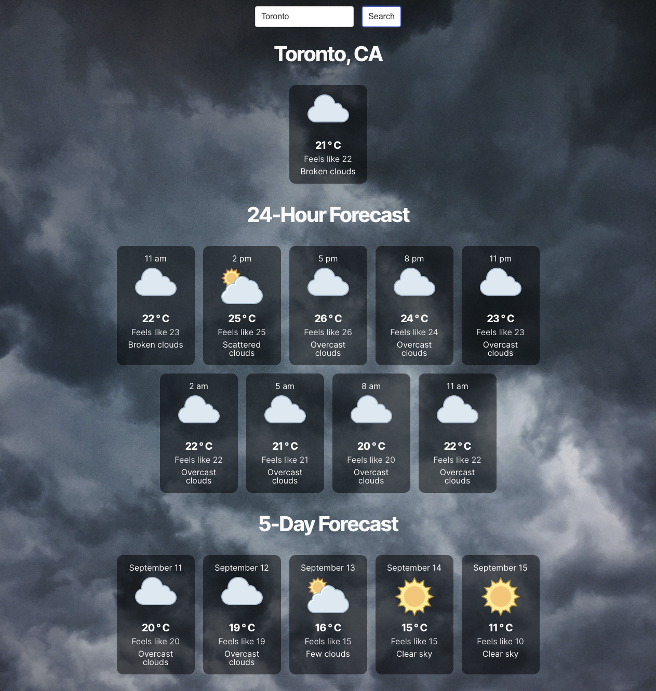

# JavaScript Weather App

## Overview

Project for The Odin Project to create a weather app using the OpenWeather API and JavaScript (https://www.theodinproject.com/lessons/javascript-weather-app). Using the application, users are able to enter the name of the city they are interested in and, once submit, will be provided with basic weather data, including the current weather, 24-hour forecast, and 5-day forecast.

This project wrapped up a number of lessons on working with asynchronous functions/promises/callbacks in JavaScript. Through the project, I utilized asynchronous functions (and the promises that they return) to allow users to make calls to the OpenWeather API (https://openweathermap.org/api), and then display basic weather data back to the user. The OpenWeather API, returns data in JSON format, which was then parsed and transformed into its own 'weather object' which was used to populate the webpage. Error handling was set up using catch statements and then subsequently handled by another module to display errors to the user.

The best way to view the project is live at: https://ayrt-n.github.io/weather-app-js/

Screenshot from application:

